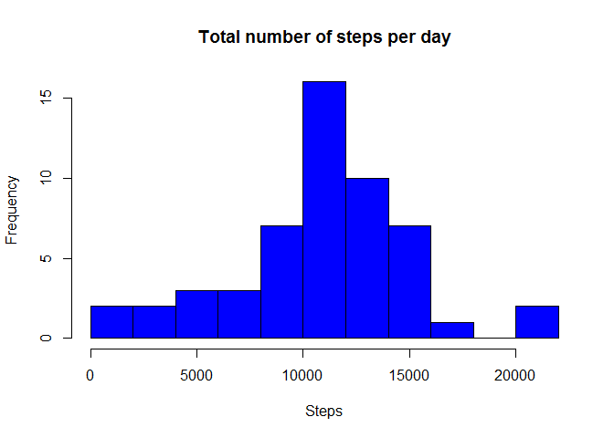
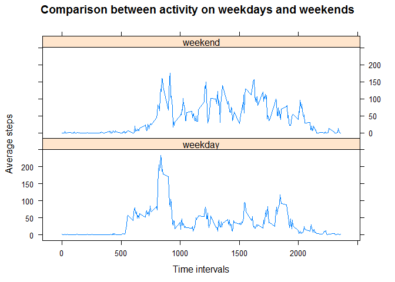

# Reproducible Research: Peer Assessment 1


## Loading and preprocessing the data

```r
#library(dplyr)
library(lattice)
activity<-read.csv("activity.csv")
activity$date<-as.Date(activity$date)
clean_activity<-activity[!is.na(activity$steps),]
```


## What is mean total number of steps taken per day?

```r
part1<-aggregate(steps ~date, clean_activity, sum)
hist(part1$steps, 
     main= "Total number of steps per day",
     xlab="Steps", 
     breaks=15,
     col="blue")
```

 

```r
mean(part1$steps)
```

```
## [1] 10766.19
```

```r
median(part1$steps)
```

```
## [1] 10765
```

## What is the average daily activity pattern?


```r
interval_steps<-aggregate(steps ~ interval, clean_activity, mean)

plot(interval_steps$interval,
     interval_steps$steps, 
     type="l", 
     xlab="Time interval", 
     ylab="Number of steps")
```

 

```r
# Use which.max() to find largest mean number of steps per day,
# then return the associated interval

interval_steps[which.max(interval_steps$steps), 1]
```

```
## [1] 835
```
So the interval with the hightest mean number of steps is 835

## Imputing missing values

```r
# count the number of NA values 
nrow(activity[is.na(activity$steps),])
```

```
## [1] 2304
```
1. The total number of missing values in the dataset is 2304

2. The strategy is to replace "NA" values with the average steps taken for
    that time interval across all days
    

```r
fixed_activity<-activity

# strategy: fill NA with average for that time interval
```

## Are there differences in activity patterns between weekdays and weekends?

```r
# use weekdays() function to label each day
clean_activity$weekend <- ifelse(weekdays(clean_activity$date) %in% 
                c("Saturday", "Sunday"),
                "weekend", "weekday")
clean_activity$weekend<-as.factor(clean_activity$weekend)

# same strategy as before but add the weekend factor variable
avg_steps_w<-aggregate(steps ~ interval + weekend, clean_activity, mean)

#lattice plot separated by weekend and weekday
xyplot(avg_steps_w$steps ~ avg_steps_w$interval | avg_steps_w$weekend, 
       type="l", 
       layout=c(1,2),
       main="Comparison between activity on weekdays and weekends",
       xlab="Time intervals",
       ylab="Average steps")
```

 
